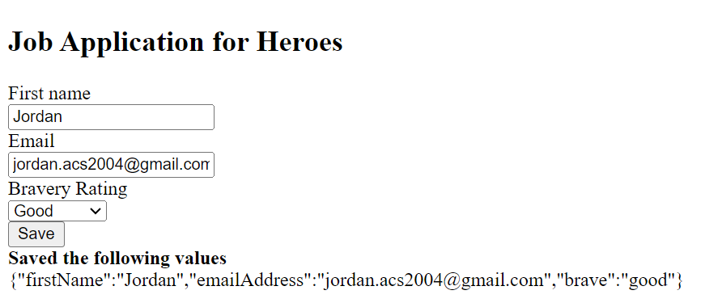

# Ponderada Angular

# Introdução

Este guia abrange a criação de formulários dinâmicos, visando otimizar o desenvolvimento de formulários sujeitos a mudanças frequentes. Seguindo este passo a passo, você será capaz de gerar formulários automaticamente conforme as demandas de dados evoluem, assegurando uma interface de usuário coesa.

# Tecnologias e Conceitos Assimilados

Um dos principais insights adquiridos neste tutorial foi a habilidade de empregar formulários dinâmicos em Angular, especialmente em situações onde a adaptação do formulário é necessária sem a exigência de alterações no código-fonte. Essa abordagem se revela particularmente valiosa em questionários, onde as perguntas podem variar de acordo com o contexto. Para alcançar esse objetivo, exploramos o uso do Reactive Forms no Angular e desenvolvemos componentes para a geração dinâmica de controles.

# Aplicação

# Análise Conclusiva 

O procedimento delineado visa aprimorar a eficiência do desenvolvimento e a experiência do usuário por meio da implementação das técnicas apresentadas. Ao adotar essas práticas no contexto do Angular, estamos capacitando a adaptação do sistema a mudanças de requisitos sem a imposição de extensas correções manuais. Este enfoque não apenas agiliza o processo de desenvolvimento, mas também fortalece a capacidade de resposta da aplicação a evoluções nas necessidades, contribuindo assim para uma experiência do usuário mais fluida e adaptável